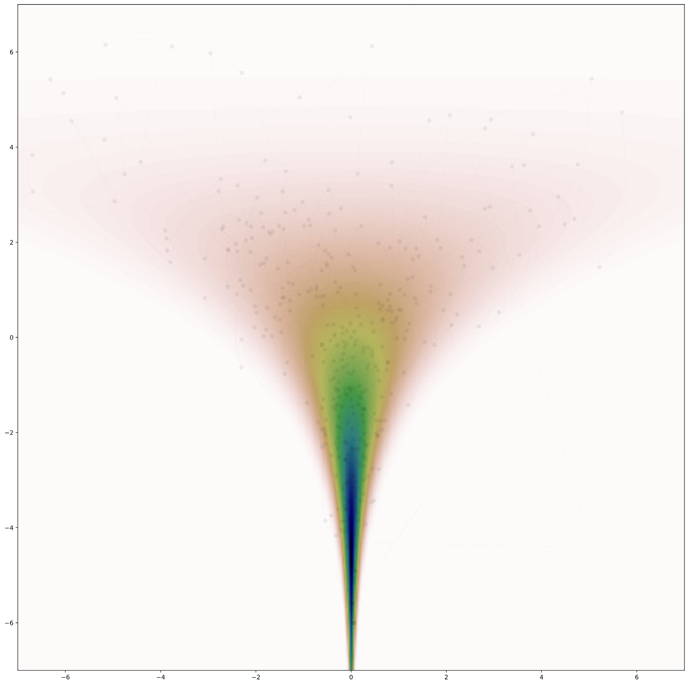

# Reimmanian-Manifold-HMC

This GitHub repository is a Python implementaion of Reimannian Manifold Hamiltonian Monte Carlo variant of the MCMC. By default it is using Betancourt softabs mapping of the Hessian matrix of the target distribution. To use it, you only need to specify your target distribution negative logaritmic function. See `test.ipynb` for the usage tutorial. To be enabled to use this package, you need to install `jax` first. Follow the instruction [Here](https://github.com/google/jax)


```python
x_init = np.array([0.,0.])
p_init = np.array([0.,0.])
hmc = Rmhmc.RMHMC(1000,target,x_init,p_init,seed=onp.random.randint(1,1000))
hmc.track=True
target.softabs_const = 1e0
hmc.epsilon *= 0.05
hmc.l *=100
hmc.run()
```


<!-- {:height="36px" width="36px"} -->
